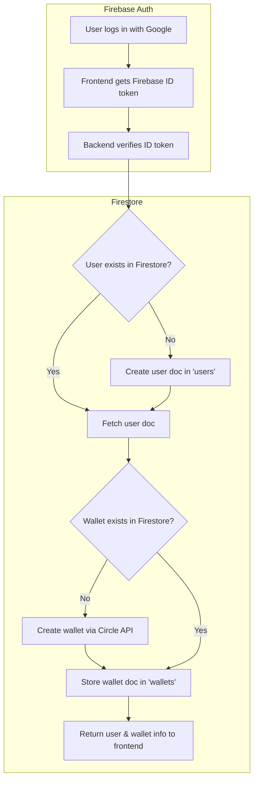

# Krypton Frontend: Auth & Wallet Data Flow

This document explains how authentication and wallet data are handled in the Krypton app after migrating to Firestore.

---

## 1. Authentication Flow

- **Frontend:**
  - Uses Firebase Authentication (Google OAuth).
  - On login, the frontend gets a Firebase ID token for the user.

- **Backend:**
  - Receives the ID token from the frontend (e.g., in `/login` endpoint).
  - Verifies the token using `firebase_admin.auth.verify_id_token`.
  - Extracts user info (Google UID, email) from the decoded token.

---

## 2. User Data Management (Firestore)

- **User Lookup/Creation:**
  - The backend checks Firestore for a user document with the given Google UID.
  - If not found, it creates a new user document in the `users` collection:
    ```json
    {
      "google_id": "<Google UID>",
      "email": "<user email>",
      "username": null
    }
    ```
  - The document ID is used as the internal user ID.

- **Username Management:**
  - When a user sets a username, the backend updates the `username` field in their Firestore document.

---

## 3. Wallet Data Management (Firestore + Circle API)

- **Wallet Creation:**
  - If the user does not have a wallet, the backend:
    1. Calls the Circle API to create a new wallet.
    2. Stores wallet info in Firestore under the `wallets` collection:
      ```json
      {
        "user_id": "<Firestore user doc ID>",
        "wallet_id": "<Circle wallet ID>",
        "wallet_address": "<on-chain address>",
        "blockchain": "ETH-SEPOLIA"
      }
      ```
    3. The document ID is the wallet ID.

- **Wallet Lookup:**
  - To find a user’s wallet, the backend queries the `wallets` collection for documents with `user_id` matching the user’s Firestore doc ID.

---

## 4. Data Structure in Firestore

- **users (collection)**
  - Each document: `{ google_id, email, username }`
- **wallets (collection)**
  - Each document: `{ user_id, wallet_id, wallet_address, blockchain }`

---

## 5. Flow Diagram



---

## Summary Table

| Step                | Data Source      | Action                                                      |
|---------------------|------------------|-------------------------------------------------------------|
| User logs in        | Firebase Auth    | Frontend gets ID token, sends to backend                    |
| Verify user         | Firestore        | Lookup by Google UID, create if not exists                  |
| Set username        | Firestore        | Update `username` field in user doc                         |
| Create wallet       | Circle API + Firestore | Create wallet via Circle, store in Firestore           |
| Lookup wallet       | Firestore        | Query `wallets` by `user_id`                                |

---

**In summary:**
- All user and wallet data is now stored and managed in Firestore.
- Authentication is handled by Firebase Auth, and the backend verifies tokens and manages user/wallet records in Firestore.
- No SQL database is used; everything is serverless and managed.
