# THE TICKET HIGHWAY v1 — one entity, one lifecycle, chair-mediated, exceptions to the CEO

**Filed by**: CDO (trial seat), 2026-08-24, on the CEO's commission verbatim: *"I need CDO on the ticketing system; how could we flow information seamlessly that land into next execution pass. Agent->CTO->Agent... Just like a JIRA ticket with multiple terminal states."*
**Status**: DESIGN awaiting CEO ratification and adversary review of the door guards.
**Binding constraints honoured**: event-sourced fold (no UPDATE anywhere in this design); control layer untouched; seats gain no pen and no trigger; absence renders UNKNOWN.

*(Filed verbatim by the chair from run-cdo-trial-2; chair verification before filing: the trace_id joints cited below checked exact — fund.py:1774-1777, 1818, 1859, 1987 — and the door guards cited are the machinery the chair worked with directly today.)*

---

## Part 1 — ARCHITECTURE

### 1.1 The one entity

A **TICKET** is a unit of work with one id, one type facet, one lifecycle, and one fold. Everything on the highway is one:

| type | today's species | today's carrier |
|---|---|---|
| `ask` | DeskRequested | events.py:135, fund.py:1799-1825 |
| `dispatch` | DeskDispatched (chair-born, no backing request) | events.py:136, fund.py:1837-1865 |
| `recommendation` | deskstore run recommendations | fund.py:2382-2431 |
| `lesson` | `## BINDS` sections, chair-carried by hand | constitution, no machine carrier at all |
| `challenge` | `## CHALLENGE` sections | constitution, no machine carrier at all |

**Identity: the ticket_id IS the trace_id, promoted to first-class.** The joint already exists in the code and is the single best thing to build on: a request births a trace (`trace_id` defaults to `request_id`, fund.py:1773-1777, 1818), a dispatch continues the request's trace or births its own (fund.py:1857-1859), a resolve carries it (fund.py:1987), and `decide_recommendation` already writes it onto the decision event (fund.py:2424). What is missing is not the thread — it is that nothing folds the thread into one thing with a state. The ticket fold is that thing. One piece of work keeps one id from a seat's ask through approval, dispatch, run, recommendation, decision, execution, to terminal state, because every event along the way already agrees on the string; the fold just starts reading it.

Ids are full uuid4, always. Prefixes are accepted at doors only to produce `did_you_mean` (the `MIN_ID_PREFIX` help at fund.py:2582-2585) and are never stored — the 8-char-prefix habit is what rotted 54 of 56 linkages.

### 1.2 The state machine

```mermaid
stateDiagram-v2
    [*] --> filed : any actor via door
    filed --> approved : CEO / via-cto (guarded door)
    filed --> in_flight : chair (dispatch-type only,\nchair-born work)
    filed --> accepted : CEO / via-cto\n(recommendation decided yes)
    approved --> in_flight : chair fires the dispatch
    in_flight --> returned : chair records the run
    returned --> accepted : human decision on the output
    returned --> done : chair closes with citation\n(review obligation met)
    accepted --> done : executor named by next_actor\nreports; chair records citation
    filed --> declined : CEO / via-cto, reason mandatory
    approved --> declined : CEO withdraws blessing\n(fund.py 1930-1954 semantics)
    returned --> declined : human says no to the output
    accepted --> declined : human reverses before execution
    filed --> superseded : human accepts a supersession edge
    approved --> superseded : same
    returned --> superseded : same
    filed --> merged : human folds into the canonical ticket\n(decision_ref points there)
    filed --> expired : chair sweep under versioned\naging policy, CEO-ratified
    approved --> expired : same
    done --> [*]
    declined --> [*]
    superseded --> [*]
    merged --> [*]
    expired --> [*]
```

**Working states**: `filed`, `approved` (blessed, undispatched — now a first-class, ageable state), `in_flight`, `returned` (the constitution's missing middle state: seat done, chair review owed), `accepted` (decided yes, execution owed to whoever `next_actor` names).

**Terminal states, five, with who may cause each:**

| terminal | meaning | who may cause it | record it must carry |
|---|---|---|---|
| `done` | the work happened | chair (closing its own review obligation, or executing an acceptance under Delegation v2) | citation to the artifact/event that proves it — no citation, no close (the Donna-sweep rule made mechanical) |
| `declined` | a human said no | CEO / via-cto identities only (`DESK_APPROVAL_ALLOWLIST`) | written reason, mandatory (fund.py:1936-1938 pattern) |
| `superseded` | replaced by a newer ticket | human, via a supersession edge (existing `Supersessions` store, fund.py:2483-2518) | `superseder_ref` |
| `merged` | this row was a duplicate/re-presentation of a canonical row | human at triage-resolve | `decision_ref` → the canonical ticket |
| `expired` | aged out under a versioned aging policy | chair sweep; the POLICY is CEO-ratified, each sweep is recorded per-ticket | policy version + age at expiry |

**Terminal is terminal.** No reopen transition exists. A dispute with a terminal ticket is a NEW ticket of type `challenge`, linked to the old one — history is never unwound, which is what append-only means at the lifecycle level. The fold enforces terminal precedence exactly as `_requests` does today (desk.py:655-677: resolution never overwrites a decline, approval never revives a resolved row — order-honest, not last-write-wins).

**No transition is automatic.** Aging queries *stage* an expiry; a run coming back *stages* `returned`... no — `returned` is appended by the chair's own record-run act, which is already a human-session write. The one rule: **every appended transition has a human session behind the pen**; the system's contribution is staging and one-click batching, never appending.

### 1.3 Agent→CTO→Agent on this machine

The hop the CEO asked for, precisely:

1. **Seat A returns.** Its structured output ends with `## STATE`, `## BINDS`, and now **`## TICKETS`** — proposed transitions ("close a4f2…, artifact X serves it") and proposed new tickets ("ask: quant to implement the survivor"), each as structured fields, not prose.
2. **The system stages.** The chair's resolve pipeline parses `## TICKETS` into a **staging table** (deskstore pattern — Postgres working state beside the event log, the same split `record_run`/`decide_recommendation` already uses: "state in the table, the decision itself on the event log. Both, and they must agree", fund.py:2383-2384). *Nothing touches the event log at staging.* Seats still have no pen; the boundary is structural, unchanged.
3. **The chair resolves the batch.** One console view, one click per batch: each accepted staged transition becomes a real `TICKET_TRANSITIONED` event appended by the chair's session; each struck one is recorded struck with a reason. This is the BINDS-review discipline (chair strikes what it disagrees with) given a door and a button.
4. **Seat B's next brief is a query.** The dispatch brief for any seat is composed *from* its in-tray query — approved tickets awaiting that seat, unconsumed lessons addressed to it — instead of from the chair's memory. The COO's BATCH PLAN mandate becomes `SELECT`, not recollection.

### 1.4 Migration of the five species — fold adapters, zero rewrites

The store's internals and history are untouched. The ticket fold (`app/fund/tickets.py`, new) reads **both** vocabularies:

- `DeskRequested` → ticket `filed` (type=ask); `DeskRequestApproved` → `approved`; `DeskRequestDeclined` → `declined`; `DeskDispatched` with a `request_id` → transition `in_flight` on that ticket; `DeskDispatched` without one → a ticket born directly `in_flight` (type=dispatch) — **which is the lamp-close fix**: that ticket now has a legitimate door to `returned` and `done` (ticket d03c09b6 closes structurally).
- `DeskRequestResolved` → `done` (legacy resolves carry no separate `returned` stage; the fold reports `returned_at: UNKNOWN` for them, never a fabricated timestamp).
- deskstore recommendations → child tickets (type=recommendation, `parent_id` = the run's ticket); `DeskRecommendationDecided` → the corresponding transition; legacy statuses map `rejected`→`declined`, `noted`→`done` (basis `noted`), per `TERMINAL_STATUSES` at desk.py:982.
- BINDS/challenges have no historical events — they enter the highway only from now on. Absence is reported as absence: pre-highway lessons are not retro-ticketed.

### 1.5 The linkage model

- **`parent_id`** — the tree: ask → its run → its recommendation children. Written at birth by the door, from the ticket_id the caller is acting under.
- **`decision_ref`** — **one decision, one row, made structural.** A ticket that has ever received a decision transition carries it forever in the fold. Any door presented a "new" row that names a decided ticket (COO re-presentations, R39's costume) must carry `decision_ref`; the only legal outcomes are `merged` (it was the same decision — cite it) or a supersession edge (it is a new decision — say what it replaces). A decided ticket presented bare is **refused, 409, with the lineage in the detail** — the `_refuse_if_superseded` shape (fund.py:2603-2652), including the `ApprovalRefused` event so the riskofficer sees refusals in `/fund/events`, not in somebody's terminal.
- **Supersession** — reuses the existing edge store and refusal machinery wholesale (fund.py:2483-2546); tickets add nothing to it but a second `kind`.
- **Lessons with receipts** — a `## BINDS` entry becomes, at chair resolve, one `lesson` ticket per receiving seat (`filed`, addressed). When the chair composes that seat's next brief from its in-tray, the pipeline appends `TICKET_CONSUMED` naming the dispatch that carried it; the lesson goes `done` when the receiving seat's STATE acknowledges it (chair judgement at resolve, as now). Between filing and consumption, **consumption lag is a number**, and an unconsumed lesson ages on a board instead of in a file nobody reads.

---

## Part 2 — TECH IMPLEMENTATION

### 2.1 New event types (additive members of the enum; store internals untouched)

Four, deliberately few:

| event | payload core | appended by |
|---|---|---|
| `TICKET_OPENED` | ticket_id, type, subject, parent_id?, filed_for (seat attribution), next_actor?, due_date?, money_at_stake?, reversibility? | door, human session |
| `TICKET_TRANSITIONED` | ticket_id, from, to, actor, basis (`decision` / `dispatch` / `review-close` / `sweep:<policy-vN>`), citation?, reason?, decision_ref?, staged_ref? | door, human session |
| `TICKET_LINKED` | ticket_id, link_kind (`parent` / `decision_ref` / `serves`), target_id, basis | door or backfill sweep |
| `TICKET_CONSUMED` | ticket_id (lesson), consumed_by_dispatch, seat | chair resolve pipeline |

The three optional routing fields ride on `TICKET_OPENED` from birth — `next_actor`, `due_date`, `reversibility` — the exact trio the builder's D9 finding said nothing writes (`kind` is free text, 84 values, routing moves 18.7% of rows; `due_date` separates zero rows because nothing writes it). The ticket door is where they finally get written.

### 2.2 The fold

`app/fund/tickets.py::fold(store)` — one pass over the stream, adapters for the six legacy desk types plus the four new ones, terminal precedence per desk.py:655-677, `next_actor` resolution reusing `desk.next_actor`'s precedence exactly (desk.py:1041-1119: terminal → explicit field → lifecycle → kind → default-to-CEO; version constant published in the payload like `NEXT_ACTOR_RULES_VERSION`, desk.py:987). Every age/duration is computed from event timestamps via the `_ts` instant-parse (desk.py:681-702), and an uncomputable age is `null` + `"age_basis": "unknown"` — never zero.

### 2.3 The doors and the generalized phantom guard

- `POST /fund/tickets` — open (typed, validated).
- `POST /fund/tickets/{id}/transition` — guarded: **(1)** `_refuse_unknown_ticket` — the phantom guard generalized from fund.py:2549-2600: every door validates the id against the fold before appending; 404 + `did_you_mean`; fails open on an unreadable fold with the warning logged, exactly as today, because a rendering guard must not become an outage on the approval path. **(2)** decision transitions (`approved`, `accepted`, `declined`, all terminals) take the approval-channel guard — allowlist + echo + via-cto instruction (fund.py:1901-1902), reused not rewritten. **(3)** advancing transitions take the supersession refusal (fund.py:2603, `ADVANCING_REC_STATUSES` generalized). **(4)** the decision_ref rule of §1.5.
- `POST /fund/tickets/{id}/link` — guarded the same way on both ends of the link.
- `GET /fund/tickets/staged` + `POST /fund/tickets/staged/resolve` — the chair's batch console: accept/strike per row, one POST per batch, each acceptance appending its own `TICKET_TRANSITIONED`.

### 2.4 Reused vs built

**Reused** (this is most of the system): trace_id plumbing; `resolve_request_ids` full-uuid normalization at the door (fund.py:2156-2190); `Supersessions` + `approval_refusal` + the disclosed fail-open (fund.py:2521-2546); the approval guard; the advisory-then-enforce versioned door (`routing_version` / `ROUTING_ENFORCED_FROM_VERSION`, fund.py:2140-2142, 2212-2224) for `## TICKETS` adoption; the card contract discipline (desk_card_contract.v1.json → a **v2, additive** — the v1 lifecycle `filed/approved/awaiting_dispatch/dispatched/delivered` and the "ACCEPTED, EXECUTION YOURS" case map cleanly onto ticket states); `recordRow.ts`'s NOBODY semantics (recordRow.ts:38-39) and `deskLanes.ts`'s served-vs-shown honesty (deskLanes.ts:130). **Built**: the fold, the four events, the doors, the staging table, the `## TICKETS` parser, the views.

### 2.5 Backfill — the 4a4f6b0d scope, and the fence

History is never rewritten; the fold's adapters make old events legible as tickets with zero migration. One optional, chair-executed sweep (the hygiene-backfill pattern) appends `TICKET_LINKED` events **only for joins the record mechanically supports**: dispatches carrying `request_id`, runs whose `serves_requests` survive full-id normalization. Everything else — the 54 of 56 that only prose connects — is **fenced as pre-highway, counted and labelled, never guessed** (clean field rule: an unmeasurable linkage is not a licence to invent one). Linkage coverage is then an honest number with a dated floor under it.

### 2.6 Builder-dispatch-sized slices (~1h each, falsifiable acceptance per slice)

1. **The fold + `GET /fund/tickets`** (read-only, adapters over existing events). *Accept*: every existing request/dispatch/recommendation appears exactly once; counts reconcile with `desk_load`; zero write paths in the diff.
2. **Events + doors + generalized phantom guard.** *Accept*: unknown id → 404 with `did_you_mean`; a chair-born dispatch ticket reaches `done` (the d03c09b6 test); no legacy endpoint's behaviour changes.
3. **decision_ref + merged/superseded terminals.** *Accept*: replaying the R39 sequence produces one canonical row and refused re-presentations (409 + `ApprovalRefused` event), never eight rows.
4. **Staging table + batch-resolve console + `## TICKETS` parser.** *Accept*: a seat's block becomes staged rows with zero event-log writes; one POST resolves a batch; a struck proposal leaves a struck record.
5. **Lesson tickets + consumption receipts.** *Accept*: one BINDS at resolve → one ticket per receiving seat; consumption lag queryable; a never-consumed lesson ages instead of vanishing.
6. **Views + CEO exceptions filter + card contract v2.** *Accept*: an executed-at-resolve ticket cannot render Accept/Reject (the 16-row regression, as a contract case); absent ages render UNKNOWN.
7. **Producer templates** (brief boilerplate gains `## TICKETS`; adoption advisory-first per §2.4). *Accept*: adoption measured per run and reported — the failure-6 lesson is that enforcing at the door without changing the producers' templates yields 0 of 116.
8. **Historical linkage backfill** (chair-executed, not a builder act — it appends to the record). *Accept*: coverage moves only by record-supported joins; the fenced cohort is counted, dated, and excluded from the coverage denominator's target.

Slices 1–2 ship value alone (the lamp-close gap and phantom guard close on day one); nothing later blocks on the CEO beyond ratifying this memo and the aging policy.

---

## Part 3 — MONITORING

**Per-desk views (all queries over one fold, no per-view state):** each seat gets an **in-tray** (`approved` tickets awaiting its dispatch + unconsumed `lesson` tickets addressed to it) and an **out-tray** (`returned` tickets it produced awaiting chair review). The existing lamps map: *working* = `in_flight`, *awaiting review* = `returned` (the third state finally rendered), *idle* = neither — desk.py:721-871's semantics preserved, including `review_detectable` honesty.

**Flow metrics that matter:** time-in-state per state (free from event timestamps); **aging thresholds per state, versioned constants** (a threshold moves only with a written reason); **linkage coverage** (% of post-highway tickets with parent or fence-mark; pre-highway fenced cohort reported beside it, never inside it); **BIND consumption lag** (lesson `filed` → `TICKET_CONSUMED`); **approved-undispatched age** (failure 7's number, now a first-class series); staged-batch turnaround (how long proposals sit before the chair's click).

**The chair's console:** the staged-transitions batch view (accept/strike/one click), the `returned` queue ranked by age, the JOINS answers as queries (approved-undispatched by what they unblock, unconsumed lessons, aged asks). Vishesh's flow mandate keeps the *judgement* (ranking, THE NEXT FIVE); the highway supplies him measured inputs instead of archaeology.

**The CEO's desk — exceptions only.** A ticket qualifies iff: `next_actor` resolves to `ceo`; OR aged past its state's threshold; OR blocked on a missing join (an `accepted` ticket whose executor has no dispatch after X days); OR `money_at_stake` ≥ Y (both X and Y versioned, CEO-set); OR a `challenge` ticket targeting a terminal state. Everything else lives on the on-demand board: the five `deskLanes` become five ticket queries, each keeping the served-vs-shown double count and its four-answer honesty (deskLanes.ts:26-34, 130); terminal tickets render as record rows with the NOBODY treatment (recordRow.ts). Every absent number on every view is UNKNOWN with a stated basis — the fold ships the basis field so no surface has to invent one.

---

## Part 4 — WHAT THIS KILLS (the falsifiability section)

| # | measured failure | structural mechanism | falsified if |
|---|---|---|---|
| 1 | Linkage rot (2/56 linkable) | linkage is an event written at the door against full uuids (§1.5, §2.5's normalization reuse); prose joins have no reader; history fenced, not guessed | any post-highway run lands unlinkable to its ticket |
| 2 | One decision, eight rows (R39) | decision_ref rule: a decided ticket re-presented bare is a 409 with lineage; only `merged` or supersession are legal (§1.5, slice 3) | any decided ticket accrues a second live row |
| 3 | Executed-shown-open (16 rows, "like WTF") | execution is a fold transition (`accepted`→`done`, citation mandatory) recorded in the same act as the resolve; views have no state of their own; contract v2 case makes it a pinned regression | one terminal ticket renders a decision control |
| 4 | Lamp-close gap (d03c09b6) | a chair-born dispatch IS a ticket with first-class `returned`/`done` doors (§1.4) | any dispatch exists that no legitimate event can close |
| 5 | Phantom aggregates (seq 1382) | `_refuse_unknown_ticket` on **every** door — no append against an id the fold has never seen, except OPENED (§2.3) | any 200 lands against a fold-unknown id |
| 6 | Structured filing 0/116 | producers first: templates in the brief (slice 7), advisory-then-enforce versioned door (§2.4), adoption measured per run | two weeks post-slice-7 with adoption still ~0 kills this memo's enforcement plan, not the seats |
| 7 | Approved-undispatched invisible (56) | `approved` is a distinct, aged, queried state; past-threshold escalates to the CEO's exceptions view (§3) | an approved ticket ages past threshold without surfacing anywhere |
| 8 | BINDS carried by hand | lesson tickets with consumption receipts and a lag metric; unconsumed lessons age visibly (§1.5, slice 5) | a filed lesson reaches the receiving seat's dispatch without a receipt, or a lesson silently vanishes |

**What this design does NOT do**, stated so nobody wonders: no seat gains a pen or a trigger; the CEO's click count falls (batches, exceptions) and his authority does not; no threshold moves; the guard, autopolicy, gate, risk limits, exit mechanics, and event-store internals are untouched — every new event is an additive enum member, every guard is a reuse of one that exists, and everything the system stages waits for a human hand.
